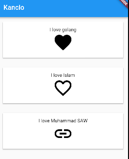
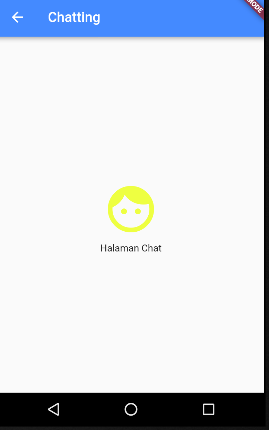

# Basic - flutter
## STEP 1
~~~dart
import 'package:flutter/material.dart';
void main(){
runApp(
  new Container(
    decoration: new BoxDecoration(color: Colors.blueAccent),
    child: new Center(
      child: new Text("Hello jihar")
    )
  )
);
}
~~~

## STEP 2
~~~dart
import 'package:flutter/material.dart';

void main(){
  runApp(
    new MaterialApp(
      home: new MyStatelessWidget()                           //new
    )
  );
}
// all of code bellow is new
class MyStatelessWidget extends StatelessWidget{               
    @override                                                  
    Widget build(BuildContext context){                        
      return new Scaffold(                                     
        appBar: new AppBar(title: new Text("Kancio"))        
      );        
    }           
}               
~~~

## Step 3
~~~dart
import 'package:flutter/material.dart';

void main(){
  runApp(
    new MaterialApp(
      home: new MyStatelessWidget()
    )
  );
}

class MyStatelessWidget extends StatelessWidget{
    @override
    Widget build(BuildContext context){
      return new Scaffold(
        appBar: new AppBar(title: new Text("Kancio")),
        body: new Container(                              //new
          child:new Column(                               //new
            children: <Widget>[                           //new
              new Text("Hello"),                          //new
              new Text("My name is Jihar Al Gifari"),     //new
              new Text("I am a man"),                     //new
            ],  //new
          ),  //new
        )  //new
      );
    }
}
~~~

## Step 4 add card
~~~dart
import 'package:flutter/material.dart';

void main(){
  runApp(
    new MaterialApp(
      home: new MyStatelessWidget()
    )
  );
}

class MyStatelessWidget extends StatelessWidget{
    @override
    Widget build(BuildContext context){
      return new Scaffold(
        appBar: new AppBar(title: new Text("Kancio")),
        body: new Container(
          child:new Column(
            children: <Widget>[
              new MyLove(),                             //new
              new MyLove(),                             //new
              new MyLove(),                             //new
            ],
          ),
        )
      );
    }
}

// all of code bellow is new
class MyLove extends StatelessWidget {
  MyLove({this.title, this.icon});
  final Widget title;
  final Widget icon;

  @override
  Widget build(BuildContext context){
    return new Container(
      child: new Card(
        child: new Column(
          children: <Widget>[
            new Text("I like learn go and flutter"),
            new Icon(Icons.favorite)
          ],
        ),
      ),
    );
  }
}
~~~

## Step 5
~~~dart
import 'package:flutter/material.dart';

void main(){
  runApp(
    new MaterialApp(
      home: new MyStatelessWidget()
    )
  );
}

class MyStatelessWidget extends StatelessWidget{
    @override
    Widget build(BuildContext context){
      return new Scaffold(
        appBar: new AppBar(title: new Text("Kancio")),
        body: new Container(
          child:new Column(
            crossAxisAlignment: CrossAxisAlignment. stretch,       // new
            children: <Widget>[
              new MyLove(),
              new MyLove(),                                        // new
              new MyLove(),                                        // new
            ],
          ),
        )
      );
    }
}

class MyLove extends StatelessWidget {
  MyLove({this.title, this.icon});
  final Widget title;
  final Widget icon;

  @override
  Widget build(BuildContext context){
    return new Container(
      child: new Card(
        child: new Column(
          children: <Widget>[
            new Text("I like learn go and flutter"),
            new Icon(Icons.favorite)
          ],
        ),
      ),
    );
  }
}
~~~

## Step 6
~~~dart
import 'package:flutter/material.dart';

void main(){
  runApp(
    new MaterialApp(
      home: new MyStatelessWidget()
    )
  );
}

class MyStatelessWidget extends StatelessWidget{
    @override
    Widget build(BuildContext context){
      return new Scaffold(
        appBar: new AppBar(title: new Text("Kancio")),
        body: new Container(
          child:new Column(
            crossAxisAlignment: CrossAxisAlignment. stretch,
            children: <Widget>[
              new MyLove(
                title: new Text("I love golang"),
                icon: new Icon(Icons.favorite),
              ),                                              //changed
              new MyLove(
                title: new Text("I love Islam"),
                icon: new Icon(Icons.favorite_border),
              ),                                              //changed
              new MyLove(
                title: new Text("I love Muhammad SAW"),
                icon: new Icon(Icons.link),
              ),                                              //changed
            ],
          ),
        )
      );
    }
}

class MyLove extends StatelessWidget {
  MyLove({this.title, this.icon});
  final Widget title;
  final Widget icon;

  @override
  Widget build(BuildContext context){
    return new Container(
      child: new Card(
        child: new Column(
          children: <Widget>[
            this.title,             // edit
            this.icon,              // edit
          ],
        ),
      ),
    );
  }
}
~~~

## Step 7 Add Padding
~~~dart
import 'package:flutter/material.dart';

void main(){
  runApp(
    new MaterialApp(
      home: new MyStatelessWidget()
    )
  );
}

class MyStatelessWidget extends StatelessWidget{
    @override
    Widget build(BuildContext context){
      return new Scaffold(
        appBar: new AppBar(title: new Text("Kancio")),
        body: new Container(
          padding:new EdgeInsets.all(10.0) , // new
          child:new Column(
            crossAxisAlignment: CrossAxisAlignment. stretch,
            children: <Widget>[
              new MyLove(
                title: new Text("I love golang"),
                icon: new Icon(Icons.favorite),
              ),
              new MyLove(
                title: new Text("I love Islam"),
                icon: new Icon(Icons.favorite_border),
              ),
              new MyLove(
                title: new Text("I love Muhammad SAW"),
                icon: new Icon(Icons.link),
              ),
            ],
          ),
        )
      );
    }
}

class MyLove extends StatelessWidget {
  MyLove({this.title, this.icon});
  final Widget title;
  final Widget icon;

  @override
  Widget build(BuildContext context){
    return new Container(
      padding: new EdgeInsets.only(bottom: 20.0),  // new
      child: new Card(
        child: new Column(
          children: <Widget>[
            this.title,
            this.icon,
          ],
        ),
      ),
    );
  }
}
~~~

## Step 8 Add padding in the padding, and Size for icons
~~~dart
import 'package:flutter/material.dart';

void main(){
  runApp(
    new MaterialApp(
      home: new MyStatelessWidget()
    )
  );
}

class MyStatelessWidget extends StatelessWidget{
    @override
    Widget build(BuildContext context){
      return new Scaffold(
        appBar: new AppBar(title: new Text("Kancio")),
        body: new Container(
          padding:new EdgeInsets.all(10.0) ,
          child:new Column(
            crossAxisAlignment: CrossAxisAlignment. stretch,
            children: <Widget>[
              new MyLove(
                title: new Text("I love golang"),
                icon: new Icon(Icons.favorite, size:60.0),        //edit size
              ),
              new MyLove(
                title: new Text("I love Islam"),
                icon: new Icon(Icons.favorite_border, size:60.0),   //edit size
              ),
              new MyLove(
                title: new Text("I love Muhammad SAW"),
                icon: new Icon(Icons.link, size:60.0),          //edit size
              ),
            ],
          ),
        )
      );
    }
}

class MyLove extends StatelessWidget {
  MyLove({this.title, this.icon});
  final Widget title;
  final Widget icon;

  @override
  Widget build(BuildContext context){
    return new Container(
      padding: new EdgeInsets.only(bottom: 20.0),
      child: new Card(
        child: new Container(                     //new
          padding: new EdgeInsets.all(15.0),      //new
          child: new Column(
            children: <Widget>[
              this.title,
              this.icon,
            ],
          ),
        )
      ),
    );
  }
}
~~~

## Step 9 add color icon
~~~dart
  new MyLove(
    title: new Text("I love golang"),
    icon: new Icon(Icons.favorite, size:60.0, color: Colors.redAccent),
),
~~~

## Step 10 Font Size
~~~dart
title: new Text("I love Muhammad SAW",
    style: new TextStyle(
    fontSize: 20.0
    ),
),
~~~

## Step 11 Add Drawer.
~~~dart
class MyStatelessWidget extends StatelessWidget{
    var drawer = new Drawer();                                 // New
    @override
    Widget build(BuildContext context){
      return new Scaffold(
        drawer: drawer,                                        // New
        appBar: new AppBar(title: new Text("Kancio")),
        body: new Container(
          padding:new EdgeInsets.all(10.0) ,
          child:new Column(
            crossAxisAlignment: CrossAxisAlignment. stretch,
            children: <Widget>[
              new MyLove(
                title: new Text("I love golang",
                style: new TextStyle(
                  fontSize: 20.0
                ),
                ),
                icon: new Icon(Icons.favorite, size:60.0, color: Colors.redAccent),
              ),
              new MyLove(
                title: new Text("I love Islam",
                style: new TextStyle(
                  fontSize: 20.0
                ),
                ),
                icon: new Icon(Icons.favorite_border, size:60.0, color: Colors.greenAccent),
              ),
              new MyLove(
                title: new Text("I love Muhammad SAW",
                style: new TextStyle(
                  fontSize: 20.0
                ),
                ),
                icon: new Icon(Icons.link, size:60.0, color: Colors.lightBlue),
              ),
            ],
          ),
        )
      );
    }
}
~~~
_______________________________________________________
|||
_______________________________________________________

# Step 12 ad Widget
~~~dart
import 'package:flutter/material.dart';

void main(){
  runApp(
    new MaterialApp(
      home: new MyStatelessWidget()
    )
  );
}

class MyStatelessWidget extends StatelessWidget{
    @override
    Widget build(BuildContext context){
      Column buildButtonColumn(IconData icon, String label) {
      Color color = Theme.of(context).primaryColor;
      return new Column(
        mainAxisSize: MainAxisSize.min,
        mainAxisAlignment: MainAxisAlignment.end,
        children: [
          new Icon(icon, color: color),
          new Container(
            margin: const EdgeInsets.only(top: 8.0),
            child: new Text(
              label,
              style: new TextStyle(
                fontSize: 12.0,
                fontWeight: FontWeight.w400,
                color: color,
              ),
            ),
          ),
        ],
      );
    }
      return new Scaffold(
        appBar: new AppBar(title: new Text("Kancio")),
        body: new Container(
          padding:new EdgeInsets.all(10.0) ,
          child:new Column(
            crossAxisAlignment: CrossAxisAlignment. stretch,
            children: <Widget>[
              new MyStatus(
                title: new Text("I love golang",
                  style: new TextStyle(
                    fontSize: 24.0,
                  ),
                ),
                negoBtn: new Row(
                  mainAxisAlignment: MainAxisAlignment.spaceEvenly,
                  children: <Widget>[
                    buildButtonColumn(Icons.favorite, 'Suka'),
                    buildButtonColumn(Icons.comment, 'Komentar'),
                    buildButtonColumn(Icons.message, 'Nego'),
                    buildButtonColumn(Icons.add_shopping_cart, 'Beli'),
                  ],
                ),
              ),
            ],
          ),
        )
      );
    }
}

class MyStatus extends StatelessWidget {
  MyStatus({this.title, this.negoBtn});
  final Widget title;
  final Widget negoBtn;

  @override
  Widget build(BuildContext context){
    return new Container(
      padding: new EdgeInsets.only(bottom: 20.0),
      child: new Card(
        child: new Container(
          padding: new EdgeInsets.all(15.0),
          child: new Column(
            children: <Widget>[
              this.title,
              this.negoBtn,
            ],
          ),
        )
      ),
    );
  }
}
~~~

## Step 15 Add IconButton (Routes and Navigation)
~~~dart
import 'package:flutter/material.dart';

void main(){
  runApp(new MaterialApp(
      home: new HalamanUtama()
    ));
}

class HalamanUtama extends StatelessWidget {
  @override
  Widget build(BuildContext context){
      return new Scaffold(
        appBar: new AppBar(title: new Text("Kancio"), backgroundColor: Colors.blueAccent,),
        body: new Container(
          child: new Center(
            child: new Column(
              mainAxisAlignment: MainAxisAlignment.center,
              children: <Widget>[
                new IconButton(
                  icon: new Icon(Icons.message, color: Colors.greenAccent),
                  iconSize: 80.0,
                  onPressed: null,
                ),
                new Text("Halaman Utama")
              ]
            )
          )
        )
      );
  }
}
~~~

### Lanjutan untuk Routes
~~~ dart
import 'package:flutter/material.dart';

void main(){
  runApp(new MaterialApp(
      home: new HalamanUtama(),
      routes: <String, WidgetBuilder>{                                // new
          "/chat": (BuildContext context) => new HalamanChat()        // new
      },                                                              // new
    ));
}

class HalamanUtama extends StatelessWidget {
  @override
  Widget build(BuildContext context){
      return new Scaffold(
        appBar: new AppBar(title: new Text("Kancio"), backgroundColor: Colors.blueAccent,),
        body: new Container(
          child: new Center(
            child: new Column(
              mainAxisAlignment: MainAxisAlignment.center,
              children: <Widget>[
                new IconButton(
                  icon: new Icon(Icons.message, color: Colors.greenAccent),
                  iconSize: 80.0,
                  onPressed: (){Navigator.of(context).pushNamed("/chat");}
                ),
                new Text("Halaman Utama")
              ]
            )
          )
        )
      );
  }
}

//new
class HalamanChat extends StatelessWidget {
  @override
  Widget build(BuildContext context){
      return new Scaffold(
        appBar: new AppBar(title: new Text("Chatting"), backgroundColor: Colors.blueAccent,),
        body: new Container(
          child: new Center(
            child: new Column(
              mainAxisAlignment: MainAxisAlignment.center,
              children: <Widget>[
                new IconButton(
                  icon: new Icon(Icons.face, color: Colors.limeAccent),
                  iconSize: 80.0,
                  onPressed: null,
                ),
                new Text("Halaman Chat")
              ]
            )
          )
        )
      );
  }
}
~~~

